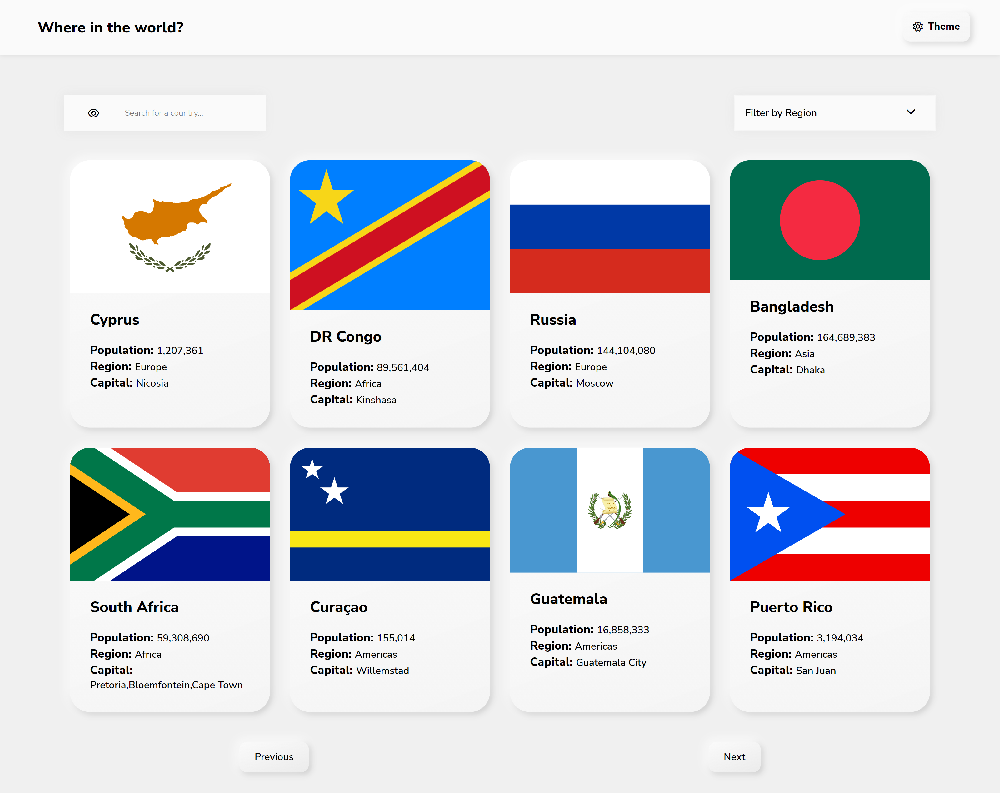

# Frontend Mentor - REST Countries API with color theme switcher solution

This is a solution to the [REST Countries API with color theme switcher challenge on Frontend Mentor](https://www.frontendmentor.io/challenges/rest-countries-api-with-color-theme-switcher-5cacc469fec04111f7b848ca).

## Links

- [GitHub](https://github.com/avsecam/FM-CountriesAPI)
- [Live Site](https://fm-countries.onrender.com/)

## Built with

- HTML with Pug
- CSS with SCSS
- Express.js
- Axios

## Author

- Frontend Mentor - [@avsecam](https://www.frontendmentor.io/profile/avsecam)
